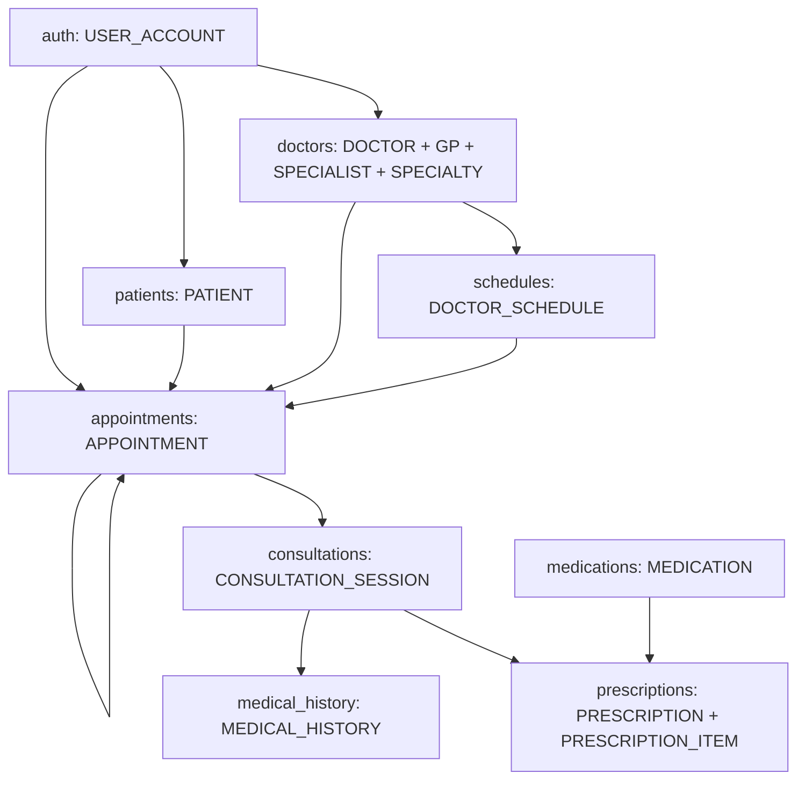

# Module chức năng và entity baseline

Cập nhật 2026-10-05: 9 module nghiệp vụ và 1 module quản trị, ánh xạ đúng 13 relation/77 thuộc tính từ dictionary Phase 2. `module_manifest.json` lưu mapping cột/type/null/default/constraint, owner, đường dẫn và SHA-256 nguồn. Entity là dataclass biểu diễn row; services và MySQL constraints/triggers thực thi integrity/use case.

## Phân chia module

| Module | Entity sở hữu | Owner dữ liệu/nghiệp vụ | Reviewer |
|---|---|---|---|
| `auth` | `USER_ACCOUNT` | Tuyền | Tiến |
| `patients` | `PATIENT` | Tiến | Tuyền |
| `doctors` | `DOCTOR`, `GENERAL_PRACTITIONER`, `SPECIALIST`, `SPECIALTY` | Tiến | Mai |
| `schedules` | `DOCTOR_SCHEDULE` | Mai | Tiến |
| `appointments` | `APPOINTMENT` | Mai | Tiến |
| `consultations` | `CONSULTATION_SESSION` | Mai | Tiến |
| `medical_history` | `MEDICAL_HISTORY` | Mai | Tiến |
| `prescriptions` | `PRESCRIPTION`, `PRESCRIPTION_ITEM` | Mai | Tiến |
| `medications` | `MEDICATION` | Tiến | Mai |
| `admin` | Dùng entity hiện có, không tạo bảng ADMIN | Tuyền | Tiến |

Tuyền phụ trách routes/forms/templates/static/auth/authorization và tích hợp xuyên 10 module. Tiến và Mai phụ trách entity/persistence/nghiệp vụ theo bảng. Ownership module không tạo quyền truy cập mới; role chỉ gồm ADMIN, DOCTOR, PATIENT.

## Ánh xạ entity

| Relation logic | Lớp Python | Module |
|---|---|---|
| `USER_ACCOUNT` | `UserAccount` | `auth` |
| `PATIENT` | `Patient` | `patients` |
| `DOCTOR` | `Doctor` | `doctors` |
| `GENERAL_PRACTITIONER` | `GeneralPractitioner` | `doctors` |
| `SPECIALTY` | `Specialty` | `doctors` |
| `SPECIALIST` | `Specialist` | `doctors` |
| `DOCTOR_SCHEDULE` | `DoctorSchedule` | `schedules` |
| `APPOINTMENT` | `Appointment` | `appointments` |
| `CONSULTATION_SESSION` | `ConsultationSession` | `consultations` |
| `MEDICAL_HISTORY` | `MedicalHistory` | `medical_history` |
| `MEDICATION` | `Medication` | `medications` |
| `PRESCRIPTION` | `Prescription` | `prescriptions` |
| `PRESCRIPTION_ITEM` | `PrescriptionItem` | `prescriptions` |

Mỗi lớp tại `backend/app/entities/<table>.py`, tên table là tên relation viết lowercase. ID dùng `str` tương ứng VARCHAR(20), không chuyển sang integer/autoincrement. Mapping từng thuộc tính snake_case nằm trong manifest. Literal ghi domain trong type hint, không validate khi chạy. Timestamp default SQL vẫn được truyền vào entity khi đọc row, không tự sinh ID/time.

## Quan hệ giữa module



- PATIENT.UserID và DOCTOR.UserID là FK UNIQUE tới account; role/profile rules giữ theo baseline.
- GENERAL_PRACTITIONER và SPECIALIST có DoctorID làm PK/FK tới DOCTOR. Joined-table/Option 8A: subtype row chứa cột riêng, không lặp cột DOCTOR. Service tạo account/doctor/đúng một subtype atomic; DB chặn disjoint và doctor thiếu subtype khi sử dụng, test cả trường hợp thiếu/trùng subtype.
- Specialist thuộc một SpecialtyID; GP không thêm SpecialtyID, DOCTOR không thêm discriminator/type column.
- Appointment giữ PatientID, DoctorID, ScheduleID, BookedByUserID và FK tự tham chiếu nullable FollowUpFromApptID.
- Session có AppointmentID FK UNIQUE; mỗi appointment tối đa một session. Không thêm PatientID/DoctorID vào session/history/prescription để rút ngắn JOIN.
- History và prescription tham chiếu session; item tham chiếu prescription/medication. Prescription header và ít nhất một item được tạo trong cùng transaction; lỗi item làm rollback toàn bộ, có test kiểm chứng.
- Telemedicine dùng AppointmentType/SessionType/MeetingURL hiện có. Admin dùng USER_ACCOUNT.Role; analytics truy vấn schema hiện có. Không tạo entity mới.

## Hợp đồng từng tầng

Các đường dẫn dưới đây tồn tại cho mỗi tên module trong bảng; `<module>` là ký hiệu rút gọn:

```text
backend/app/entities/<table>.py          row đúng baseline
backend/app/blueprints/<module>/         HTTP routes/role guards
backend/app/forms/<module>/              WTForms validation/CSRF
backend/app/services/<module>/           use case/ownership/transaction
backend/app/repositories/<module>/       parameterized SQL/row mapping
backend/app/templates/<module>/          giao diện tiếng Việt responsive
backend/tests/unit/<module>/             nơi đặt unit test
backend/tests/integration/<module>/      nơi đặt test DB/authorization
database/queries/<module>/               SQL theo nghiệp vụ
database/seeds/<module>/                 trỏ tới scripts/seed_demo.py
database/tests/<module>/                 trỏ tới backend/tests/integration
```

Static CSS/JS dùng chung. Luồng smoke liên module nằm trong tests/integration/consultations/test_clinical.py. Các thư mục test/SQL không có artefact riêng giữ .gitkeep; không suy ra đã có test ở mọi module từ việc tồn tại thư mục.

Route → form → service → repository → MySQL. Repository phụ thuộc entity; entity không phụ thuộc Flask/driver/service. Transaction cần cho doctor + subtype; booking + kiểm tra ca/xung đột; clinical records + prescription/items. Service kiểm quyền/ownership trước truy xuất, DB là ranh giới integrity cuối.

## Trạng thái thực thi và nghiệm thu

BASELINE-01 đã được người dùng chốt ngày 2026-10-05: EndTime cho phép NULL. Entity/DDL/validation áp dụng override; metadata Phase 2 và file nguồn vẫn giữ nguyên. ActualDurationMinutes vẫn NOT NULL theo baseline.

Đã chạy Flask/MySQL thật, 34 pytest tests đạt, Q01–Q12 chạy và EXPLAIN Q01/Q07/Q08 được lưu. Giao diện có ảnh desktop/mobile và sơ đồ DOCTOR D/T. [Evidence](verification/RESULTS.md) ghi phạm vi đã kiểm chứng, gồm temporal/concurrency, role/ownership, Completed clinical workflow, rollback và subtype.

Total subtype khi DBA insert riêng DOCTOR và prescription header chưa có item không được bảo đảm ở mọi trạng thái trung gian tại DB; service transaction và audit quản lý hai quy tắc này. Không thêm cột để tiện enforcement.

Tiến review schema/persistence/dictionary, Mai review rules/workflows/queries, Tuyền review auth/UI/integration và ráp báo cáo. Trạng thái triển khai In review; báo cáo cuối, slides/defense và peer evaluation chưa nghiệm thu. Q01–Q12 giữ một nguồn và owner trong WORK_ASSIGNMENT.
