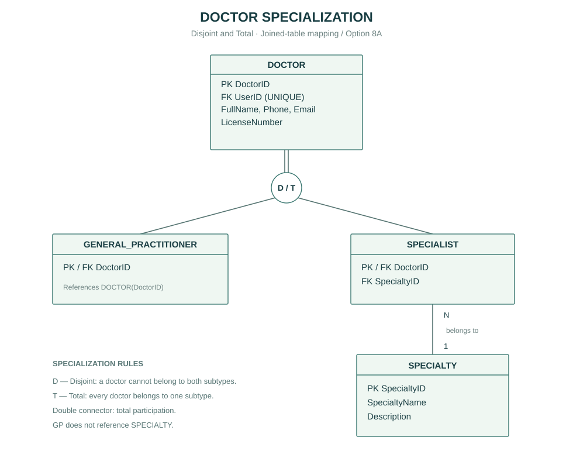

# Các thay đổi được áp dụng vào đồ án

## 1.1 System Objective

Giữ nội dung cũ trong báo cáo. Định nghĩa PATIENT đã có trong báo cáo Phase 1 hiện tại và README tham chiếu; không thêm đoạn trùng:

> PATIENT: A person who has healthcare needs and uses healthcare services. Patients can manage their personal information, search for available healthcare services, book appointments based on their preferred time or doctor, and access their personal medical information.

Trong ứng dụng, bệnh nhân tìm bác sĩ/chuyên khoa ở `/doctors/`, xem ca làm và giờ khả dụng ở `/schedules/`, hoặc nhập thời gian mong muốn trong ca đã chọn ở `/appointments/new`. Khi hai người đặt cùng giờ, DB/service chặn lịch chồng nhau.

## EER gốc Phase 1 được giữ nguyên

Sơ đồ chính thức của đồ án vẫn là [Healthcare_EER.png](../../Healthcare_EER.png) đã nộp ở Phase 1. File này không bị sửa, thay thế hoặc vẽ lại; SHA-256 được khóa trong `module_manifest.json` và kiểm tra bởi `scripts/verify_structure.py`.

Không thêm hoặc xóa entity, attribute, relationship, cardinality hay specialization trên EER. Hình DOCTOR bên dưới chỉ là hình phóng to để giải thích đúng phần đã có trong EER gốc; không phải EER mới và không dùng để thay EER gốc trong báo cáo.

## Hình giải thích DOCTOR (không thay EER gốc)

DOCTOR là supertype; GENERAL_PRACTITIONER và SPECIALIST là hai subtype Disjoint + Total, dùng PK/FK DoctorID theo joined-table/Option 8A. Chỉ SPECIALIST tham chiếu SPECIALTY.

Mã DOT: [doctor_specialization.dot](diagrams/doctor_specialization.dot). Biểu diễn SVG được cung cấp để đọc trực tiếp mà không cần cài Graphviz. Mã DOT và SVG chỉ diễn giải D/T và đường nối kép từ DOCTOR tới specialization đã tồn tại trên EER gốc.

## EndTime cho phép NULL

Theo quyết định của người dùng ngày 2026-10-05, CONSULTATION_SESSION.EndTime cho phép NULL khi phiên khám đang diễn ra. Khi kết thúc, EndTime phải sau StartTime; ActualDurationMinutes được tính theo số phút giữa hai mốc và phải nằm trong 5–120 phút. ActualDurationMinutes vẫn NOT NULL theo baseline; với phiên mở, bác sĩ nhập thời lượng đã ghi nhận trong domain này.

Metadata gốc Phase 2 vẫn được giữ trong `module_manifest.json`; `approved_overrides` chỉ có đúng một mục cho EndTime nullable và default NULL. DDL và entity áp dụng ngoại lệ này. Bản báo cáo và EER nguồn không bị ghi đè.

## Mục bổ sung về follow-up đã bỏ

Không tạo mục chỉnh sửa báo cáo riêng về FollowUpFromApptID. Quy tắc BR32 đã có trong baseline nên vẫn thi hành trong DDL/workflow: lịch không tái khám lưu NULL; nếu có giá trị, FK phải tham chiếu lịch trước hợp lệ. Việc bỏ mục chỉnh sửa không xóa thuộc tính hoặc FK trong mô hình.
